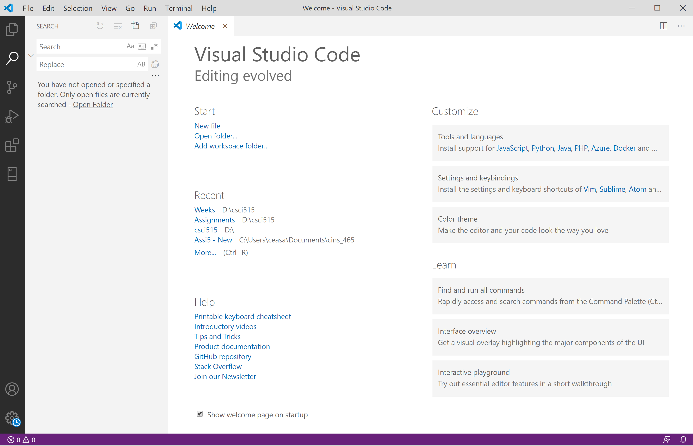

## UX Journal 1
# My VSCode experience with Git conflicts

## By Ceasar Salas on March 7, 2021

### My narrative
First I will briefly write about what happened before analyzing it according to what we have learned in class. 

VSC Welcome Screen             |  VSC Source Control 
:-------------------------:|:-------------------------:
  |    

I had been hearing good things about VSCode from various other students and professors so I endeavored to try it. 
However, I was not aware of the built-in source control that is almost constantly active. 
Which led to somehow the initial download state of VSCode becoming the default run state that it started in. 
Running the program led to VSCode effectively dumping all of my previously written work into being a clean slate
like how it was initially downloaded. At this point I kept trying despite wanting to give up. I attempted to change the 
settings of VSCode; however, the initial blank settings page kept getting restored regardless of what I did. 
The problem was something to do with Git conflicting with saving the files. I was not very good with Git at the 
time and I still have challenges now as well. By the time I realized a possible solution, VSCode kept restoring 
to a point in time when I did not have my Github data added. After much frustration, I ended up switching to 
regular Visual Studio, and uninstalling it. Mind you, this was after having done like 4 to 5 hours trying 
to make the program work to no avail, about 3 of said hours being actual work on an assignment I wrote.

### My Analysis
Clearly, from the story I provided above, the **usability** is about as low as VSCode can get: it destroyed what work
was done. The **learnability** is questionable, as the meaning of it matters more on the interpretation of the word. For me the 
**learnability** was incredibly low since despite the program being easy to use, VSCode made it incredibly hard to do any work.
VSCode, much like VS, are both very **efficient** and **effective** since work can be easily streamlined with
color-coding and fill-in-forms. The two sibling programs are very good for programming as programmers are likely
their *primary consumer target*. I believe VSCode is fully optimized to use Git, and I was not wanting that kind of
work environment. This may have been *user error* or it was that I was directed to use the wrong product to meet my goals. If it was
*user error*, then it would be good to have a clear notice of what the product is beforehand. 
Since I have mentioned *user error*, the concept of **error tolerance** can also be brought into consideration. 
In this case, I had somehow set the source control to be by hard drive which caused VSCode to preserve its state even if I tried to delete things. A simple error solution for this would be an 'nuke it' button which would immediately disconnect the source control linkage. 
***
###### Strengths
VSCode actually has a lot of strengths. As mentioned, it **affords** highly optimized text editing for programmers. 
It being *hackable*, that is ability significant personal customization, and the ability to downloaded *packages*, 
free features and extensions, make VSCode a great tool. For those that not like VSCode, there is its sibling 
program VS that users can switch to while not switching to a competitor's product. VSCode also **affords** Github 
integration as it is clearly present on the GUI. 
***
###### Weaknesses
VSCode's Github integration is also a weakness though, since for those who do not use Github, will kill their **user
experience**. Ruining any amount of satisfaction they could have had out of the tool, possibly turning them to a 
competitor product. As I mentioned, my personal experience ended up with the worst possible **usability** which 
was the deletion of completed work. If that is not a *weakness*, for being a *potential threat* to any user, I am not 
sure what is. 

###### Other Comments
I wasn't sure what the minimum requirement for writing was, so I hope this is enough. 

