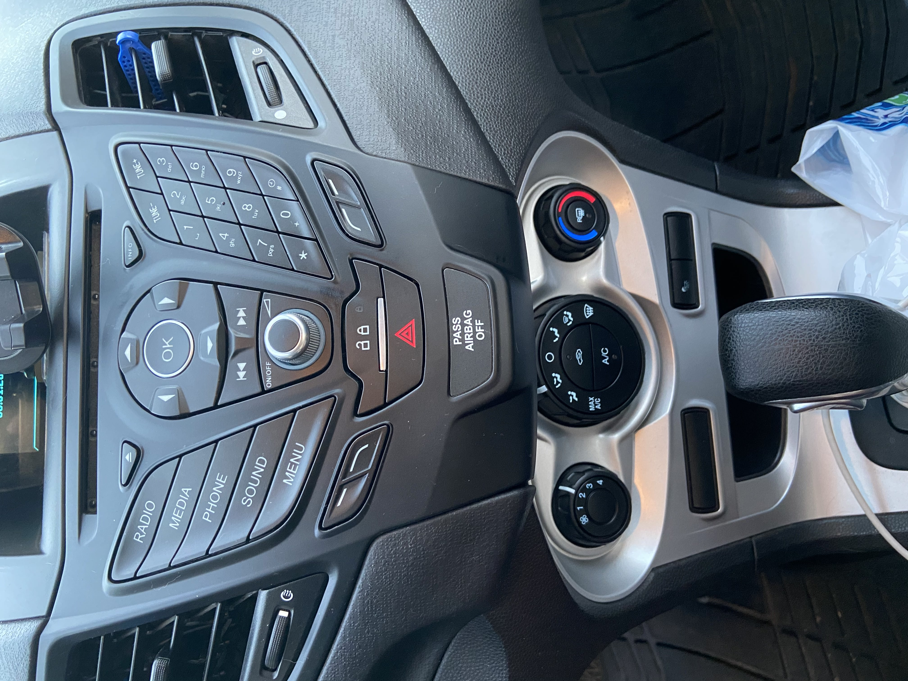
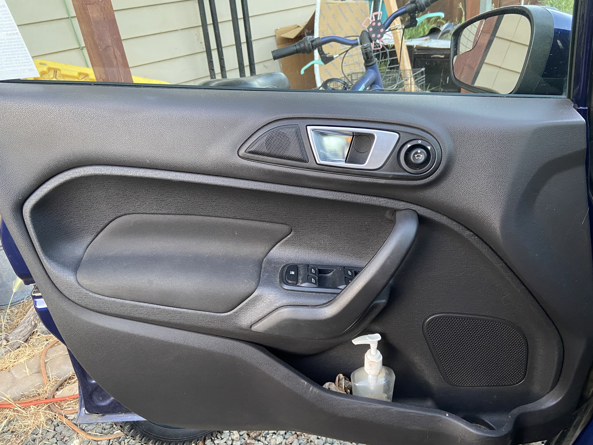
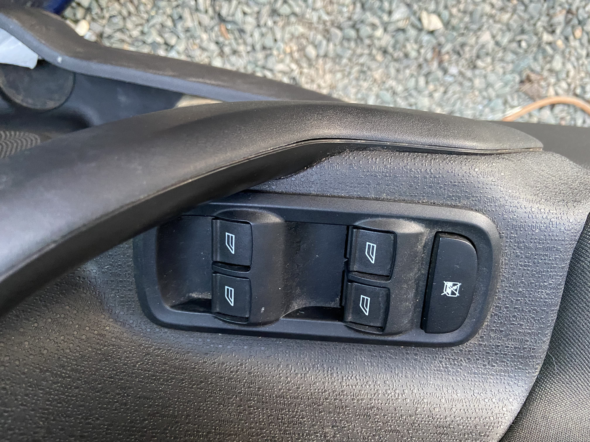

## UX Journal 2
# Failure of a Basic Function for Cars, Un/Lock

### By Ceasar Salas on March 7, 2021

### My narrative  -  1

##### Preface  -  1.1
&nbsp;&nbsp;&nbsp;&nbsp;My current car, Iris the Ford Fiesta, is a gift from my grandfather for my highschool graduation on account that I was going to college and needed a car. Even now he is both paying it off and paying for the car insurance. 
I am endlessly grateful for it; however, I realized that there were only three buttons to lock or unlock the car. One in the car and the two on the keyfob. 

##### Other Cars  -  1.2
&nbsp;&nbsp;&nbsp;&nbsp;To my knowledge, some high and semi-high end car brands are having this same general format, like Tesla for example. I would not consider myself with any real affluence. The only time I have ridden in a Tesla, was through Uber and it was the cheaper consumer Model 3. Before having my car, I was under the **common convention**that all cars have a physical lock/unlock toggle on each door for safety reasons. Finding out that other cars, or at least Teslas, was a large surprise to me. 

Center Console             |  Full Door Image             |  Door Buttons Closeup
:-------------------------:|:-------------------------:|:-------------------------:
  |    |  

##### Center Console, The Only Lock Button  -  1.3
&nbsp;&nbsp;&nbsp;&nbsp;Returning to my car, the single lock button to a physical toggle switch that is used to toggle lock all of the doors in the car at once, this will be referred to as Main. Said button has a small light on it which is lit when the doors are locked and unlit when at least one door is unlocked. That means that if only one door is unlocked then Main shows that all the doors are unlocked.

Since Main shows the "unlocked" state once any single door is open, in order to unlock all of the doors the button has to be pressed twice. The first press will lock all the doors, then the second will unlock all the doors as originally desired. This misfeature will be discussed further in the later section of Myself & the Backseat - 1.6.

##### Lock Button When Driving  -  1.4
&nbsp;&nbsp;&nbsp;&nbsp;When you drive the Iris a minimum distance or reach a minimum speed, neither of which I know for certain, the doors will automatically lock. This feature makes a lot of sense; however, what does not make sense is that at any speed the doors can be unlocked and opened. I had tested it for kicks when driving down the road at 40 plus miles per hour. I am unsure if more vehicles can be opened at any speed, but this concern will be explained more in the next section. 

##### Door Handle  -  1.5
&nbsp;&nbsp;&nbsp;&nbsp;The door handle acts as an independent door unlock. Assuming the door is locked, pulling the handle once will unlock the door, and pulling it a second time will actually open the door. The only indicator that anything has changed is the sound of the door unlocking; however, most people follow the convention that pulling a door will open said door. When the door does not open as expected, they will often miss the sound of it unlocking and tell me that the door is locked. 

##### By Myself & The Backseat  -  1.6
When I am by myself, I sometimes end up accessing the backseat or passenger side to either get or put things in the car. I can not count the number of times I get out of my car, only to pull on the backseat door to be locked. I have to effectively get back into my car so that I can unlock all the doors before being able to access the backseat, since the only ways to unlock the door are the keyfob, Main, or inside door handle. Since I have opened my door, the Main will show the "unlocked" state so I have to press it twice before it will unlock the other doors for me. This makes a conventional process of simply turning around to the driver door to unlock the doors into something needlessly more complex. 

### My Analysis

#### SEEMULES evaulation:

###### *Satisfaction*
This feature is better described as being a misfeature. I can not think of a single instance in which I have appreciated this locking method. The only time I find any satisfaction is when I joke with my passengers about how bad Main is. 

###### *Effective*
Main is incredibly in-effective. You can look at the 1.3 and 1.6 narrative sections to see that it can take two presses to actually unlock the doors despite being indicated that the doors are unlocked. 

###### *Efficient*
See the above commentary on effectiveness to see that it is also not very efficient. At least, for those that can remember, two pulls on a locked door will open it. 

###### *Memorable*
I have had Iris for about 4 years at this point, and I still forget that even though Main shows "unlocked", up to three of the doors are actually locked. 

###### *Utility*
Since it is the farthest it can be from every door while still being accessible by anyone in the front seat. When I am alone and want to unlock a door, I often have to backtrack to my driver seat to unlock said doors. 

Since Main is on the center console, people in the backseat have an easier time accessing it compared to contemporary button placements on the door. 

###### *Learnable*
I found it very easy to learn in principle. Main is a single button and the door handles are obviously for opening the doors, I would argue that it is the simplicity of the designed system that induces so many mistakes for the user. 

###### *Error Tolerance*
I am not sure whether Main showing "unlocked" when only a single door is unlocked is an error or a feature, but I have not had Main make a mistake so far. 

###### *Safety*
All of the doors can be unlocked and opened at any speed-to my recollection I was able to open my door at 60 mph. To my knowledge, this is the same case for all the doors in my car. For any given door, like I mentioned before, there is no visible indicator on the door to know if it is unlocked. In terms of an emergency and needing to get out quickly, pulling the handle twice would be faster than fiddling with the physical lock. 

#### Strengths
* Main shows unlocked when even one door is unlocked, so someone can quickly identify that someone outside can open the door. 
* As mentioned in safety above, one can quickly leave the car without the need to fiddle with a physical toggle attached to the door. 
* It makes the doors look sleeker and less cluttered. 
* Makes it easier for people in the backseat to lock or unlock the doors. 

#### Weaknesses
* Is very infuriating when one needs to get back into the car to unlock the doors only to get out again to access the door that was originally wanted. 
* May be a safety flaw that allows for accidental opening of the door when driving and does not force the car into park either (Mercedes has this feature). 
* Somehow it is not memorable at all despite being very simple. 
* Have to press Main twice to unlock the doors with any certainty. 

#### Extended Commentary
The **common convention** of cars follows the idea that every door in the vehicle has a physical indicator as to whether the door is locked or not. Generally, said indicator is in switch-like form with one side being red to show that it is in the "unlocked" state. 

The physical indicator on doors that I mention above is an example of **visual mapping** to show users that the indicator is for that particular door. 

##### Postscript
Iris has no trunk button on the inside of the car in exception to the keyfob. The assumed button for people to use is the one on the trunk itself that is fairly hidden and just above the back license plate. There are many times when I have picked up people and they wanted to put things in the trunk without knowing how to open it, which then leads to me having to get out and do it myself. 

